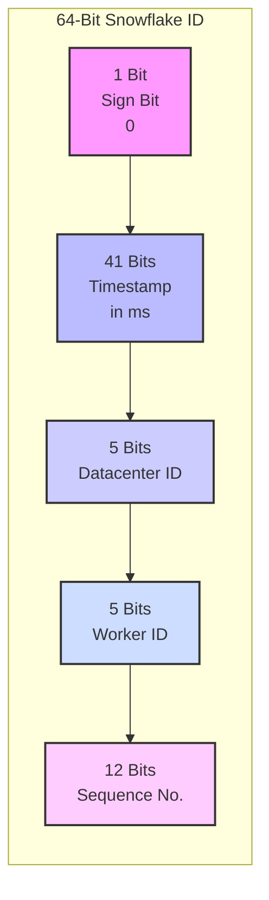

[中文](./README.zh-CN.md)

# Snowflake-rs: A Snowflake Algorithm Implementation in Rust

This project is a Rust implementation of the Snowflake unique ID generation algorithm. It aims to provide a high-performance, highly available, and thread-safe solution for distributed unique ID generation, accompanied by detailed documentation to explain its working principles and practical considerations.

## Table of Contents
- [The Challenge of Distributed Unique IDs](#the-challenge-of-distributed-unique-ids)
- [Pros and Cons of Traditional Solutions](#pros-and-cons-of-traditional-solutions)
- [Deep Dive into the Snowflake Algorithm](#deep-dive-into-the-snowflake-algorithm)
- [Limitations and Common Issues](#limitations-and-common-issues)
- [Safe Implementation in Production](#safe-implementation-in-production)
- [How to Use This Project](#how-to-use-this-project)
- [Build and Test](#build-and-test)

## The Challenge of Distributed Unique IDs

In monolithic applications, generating unique IDs is usually simple, often by using database auto-incrementing primary keys. However, in distributed systems where multiple services or nodes need to generate globally unique IDs independently, several challenges arise:

- **Uniqueness**: IDs generated at any time by any node must not conflict.
- **High Performance**: The ID generation service must be fast and not become a system bottleneck.
- **High Availability**: The system must not fail to generate IDs if a centralized node goes down.
- **Trend-Based Incrementing**: IDs should ideally be time-sorted, which is friendly for database indexing and sorting.

## Pros and Cons of Traditional Solutions

| Solution | Pros | Cons |
| :--- | :--- | :--- |
| **DB Auto-increment** | Simple to implement, ordered IDs. | Performance bottleneck (single point of write), hard to maintain after sharding. |
| **Segment/ID Pool** | High performance, ordered IDs. | Complex implementation, requires extra management services, may exhaust the ID pool. |
| **UUID** | Globally unique, simple generation. | Unordered, takes up more space as a string, not friendly for database indexing. |

## Deep Dive into the Snowflake Algorithm

Snowflake is a distributed ID generation algorithm open-sourced by Twitter. It ensures global uniqueness and trend-based incrementing by splitting a 64-bit integer into different parts.

### 64-Bit Structure Breakdown

Here is a diagram of the 64-bit structure of a Snowflake ID:



- **1 Sign Bit**: The most significant bit is always 0, ensuring the generated ID is always a positive number.
- **41 Bits Timestamp**: Stores the number of milliseconds since a custom "epoch". 41 bits can represent `2^41 - 1` milliseconds, which lasts for about 69 years.
- **10 Bits Machine ID**: These 10 bits are divided into:
  - **5 Bits Datacenter ID**: Supports up to `2^5 = 32` datacenters.
  - **5 Bits Worker ID**: Supports up to `2^5 = 32` machines per datacenter.
  - This allows for a total of `32 * 32 = 1024` nodes.
- **12 Bits Sequence Number**: A counter for IDs generated within the same millisecond. 12 bits allow for `2^12 = 4096` unique IDs per node per millisecond.

## Limitations and Common Issues

- **Clock Skew**: The Snowflake algorithm is heavily dependent on the system clock. If a node's clock is moved backward, it might generate duplicate IDs. This implementation's strategy is to return an error and refuse to generate an ID if a clock skew is detected.
- **Node Limit**: The algorithm supports a maximum of 1024 nodes. If the system scale exceeds this limit, the algorithm needs to be extended, for example, by increasing the number of bits for machine IDs.
- **Timestamp Exhaustion**: The 41-bit timestamp has an upper limit. Starting from the epoch in this project (2021-01-01), it can be used until around the year 2090. After that, the epoch time needs to be adjusted, or the timestamp bits need to be expanded.

## Safe Implementation in Production

1.  **Assign `worker_id` and `datacenter_id` properly**:
    - **Manual Configuration**: For small-scale deployments, you can assign a unique ID to each node directly in a configuration file.
    - **Automatic Registration**: For large-scale deployments, you can use distributed coordination services like Zookeeper or Etcd to let nodes automatically register and obtain a unique ID upon startup.
2.  **Fix the Epoch Time**: Once the epoch time is determined and used in production, it **must not be changed**. Changing it could lead to conflicts with historical IDs or disrupt the order.
3.  **Clock Synchronization**: Deploy NTP (Network Time Protocol) services to ensure all server clocks are synchronized, which can effectively reduce the risk of clock skew.

## How to Use This Project

Add this project as a dependency to your `Cargo.toml` (after it's published to crates.io), or integrate the `src/snowflake.rs` file directly into your project.

**Example Code:**
```rust
use std::sync::Arc;
use snowflake::SnowflakeGenerator;

fn main() {
    // Create a thread-safe Snowflake generator
    // worker_id and datacenter_id must be uniquely assigned
    let generator = Arc::new(SnowflakeGenerator::new(1, 1).unwrap());

    // Generate IDs in multiple threads
    let mut handles = vec![];
    for _ in 0..10 {
        let gen_clone = Arc::clone(&generator);
        handles.push(std::thread::spawn(move || {
            let id = gen_clone.next_id().unwrap();
            println!("Generated ID: {}", id);
        }));
    }

    for handle in handles {
        handle.join().unwrap();
    }
}
```

## Build and Test

- **Run the project**: `cargo run`
- **Run tests**: `cargo test`