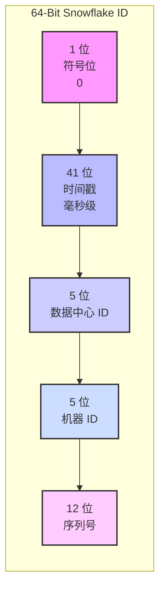

[English](./README.md)

# Snowflake-rs: 一个 Rust 实现的 Snowflake 算法

本项目是一个基于 Rust 语言实现的 Snowflake 唯一 ID 生成算法。它旨在提供一个高性能、高可用、线程安全的分布式唯一 ID 生成方案，并附带详细的文档以解释其工作原理和实践注意事项。

## 目录
- [分布式唯一 ID 的难题](#分布式唯一-id-的难题)
- [传统方案的优缺点](#传统方案的优缺点)
- [Snowflake 算法详解](#snowflake-算法详解)
- [算法的局限性与常见问题](#算法的局限性与常见问题)
- [如何在工程中安全落地](#如何在工程中安全落地)
- [如何使用本项目](#如何使用本项目)
- [构建与测试](#构建与测试)

## 分布式唯一 ID 的难题

在单体应用中，生成唯一 ID 通常很简单，可以直接使用数据库的自增主键。但在分布式系统中，多个服务或节点需要独立生成全局唯一的 ID，这就带来了挑战：

- **唯一性**: 必须保证在任何时间、任何节点生成的 ID 都不会重复。
- **高性能**: ID 生成服务必须快速，不能成为系统的性能瓶颈。
- **高可用**: 不能因为某个中心化节点宕机而导致整个系统无法生成 ID。
- **趋势递增**: ID 最好是按时间趋势递增的，这对于数据库索引和排序非常友好。

## 传统方案的优缺点

| 方案 | 优点 | 缺点 |
| :--- | :--- | :--- |
| **数据库自增** | 实现简单，ID 有序。 | 性能瓶颈（单点写入），分库分表后难以维护。 |
| **号段模式/ID 池** | 性能高，ID 有序。 | 实现复杂，需要额外管理服务，可能耗尽 ID 池。 |
| **UUID** | 全局唯一，生成简单。 | 无序，字符串形式占用空间大，对数据库索引不友好。 |

## Snowflake 算法详解

Snowflake 算法是 Twitter 开源的一种分布式 ID 生成算法，它通过将一个 64 位的整数拆分成不同部分来保证全局唯一性和趋势递增。

### 64 位结构拆解

下面是 Snowflake ID 的 64 位结构图：



- **1 位符号位**: 最高位固定为 0，确保生成的 ID 总是正数。
- **41 位时间戳**: 存储从一个自定义的“纪元时间”（epoch）开始到现在的毫秒数。41 位可以表示 `2^41 - 1` 毫秒，大约可以使用 69 年。
- **10 位工作节点 ID**: 这 10 位被分为：
  - **5 位数据中心 ID (Datacenter ID)**: 最多支持 `2^5 = 32` 个数据中心。
  - **5 位机器 ID (Worker ID)**: 每个数据中心最多支持 `2^5 = 32` 台机器。
  - 这保证了最多可以部署 `32 * 32 = 1024` 个节点。
- **12 位序列号**: 用于在同一毫秒内，对生成的 ID 进行计数。12 位意味着每个节点在同一毫秒内最多可以生成 `2^12 = 4096` 个不同的 ID。

## 算法的局限性与常见问题

- **时钟回拨 (Clock Skew)**: Snowflake 算法强依赖于系统时钟。如果节点的时钟被回拨，可能会导致生成重复的 ID。本项目的实现策略是，如果检测到时钟回拨，将直接返回错误，拒绝生成 ID，以保证唯一性。
- **节点限制**: 算法最多只支持 1024 个节点。如果系统规模超出这个限制，就需要对算法进行扩展，例如增加工作节点 ID 的位数。
- **时间戳耗尽**: 41 位的时间戳有其上限。在本项目中，从纪元时间（2021-01-01）开始，大约可以使用到 2090 年。在此之后，需要调整纪元时间或扩展时间戳位数。

## 如何在工程中安全落地

1.  **合理分配 `worker_id` 和 `datacenter_id`**:
    - **手动配置**: 在小规模部署中，可以直接在配置文件中为每个节点分配唯一的 ID。
    - **自动注册**: 在大规模部署中，可以借助 Zookeeper、Etcd 等分布式协调服务，在节点启动时自动注册并获取唯一的 ID。
2.  **固定纪元时间 (Epoch)**: 纪元时间一旦确定并上线使用，就**绝不能更改**。更改会导致生成的 ID 与历史 ID 发生冲突或顺序错乱。
3.  **时钟同步**: 部署 NTP (Network Time Protocol) 服务来保证所有服务器的时钟同步，可以有效减少时钟回拨的风险。

## 如何使用本项目

将本项目作为依赖添加到你的 `Cargo.toml` 中（发布到 crates.io 后），或者直接将 `src/snowflake.rs` 文件集成到你的项目中。

**示例代码:**
```rust
use std::sync::Arc;
use snowflake::SnowflakeGenerator;

fn main() {
    // 创建一个线程安全的 Snowflake 生成器
    // worker_id 和 datacenter_id 需要被唯一分配
    let generator = Arc::new(SnowflakeGenerator::new(1, 1).unwrap());

    // 在多线程中生成 ID
    let mut handles = vec![];
    for _ in 0..10 {
        let gen_clone = Arc::clone(&generator);
        handles.push(std::thread::spawn(move || {
            let id = gen_clone.next_id().unwrap();
            println!("Generated ID: {}", id);
        }));
    }

    for handle in handles {
        handle.join().unwrap();
    }
}
```

## 构建与测试

- **运行项目**: `cargo run`
- **运行测试**: `cargo test`